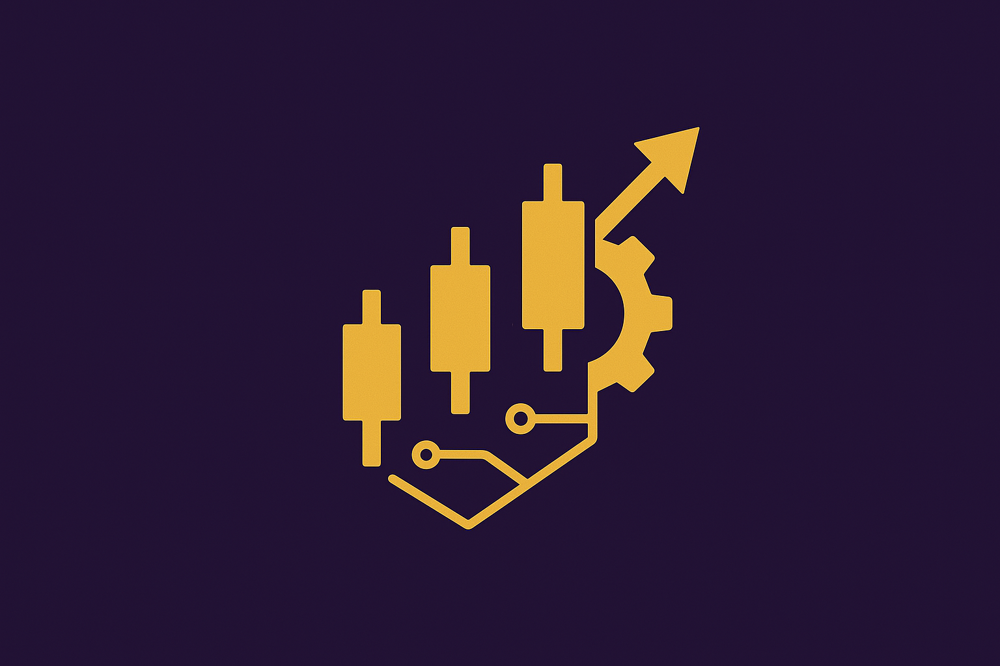

# **AxioML:** Analytics, Big Data e Machine Learning  

## 🔍 Sobre Nós

Somos Higor Cazuza e Janaína Cazuza, um casal movido por dados, precisão e automação. Unimos Ciência de Dados Quantitativa e Engenharia de Dados/MLOps para transformar informações em inteligência escalável.

📌 Sobre nós:

🔹 Higor Cazuza – Estatístico em formação, apaixonado por modelagem quantitativa e previsão de mercado.

🔹 Janaína Cazuza – Formanda em Ciência da Computação, especialista em infraestrutura e automação de dados.

Nosso objetivo é aplicar nossas expertises na interseção entre dados e finanças, explorando modelagem preditiva, séries temporais, algoritmos quantitativos e sistemas escaláveis para otimização de decisões estratégicas.

Este portfólio é um reflexo do nosso compromisso com excelência técnica e inovação. Cada artigo, projeto e experimento publicado aqui é um passo rumo à maestria em dados.

## Nossa Stack Tecnológica

### 📊 Data Science & Analytics

### ⚡ Engenharia de Dados

## 🌟 Projetos em Destaque

| Projeto | Descrição | Tecnologias |
|---------|-----------|-------------|
| [📈 Sistema de Previsão de Séries Temporais](#) | Modelos quantitativos para mercado financeiro | Python, TensorFlow, Prophet |
| [⚡ Pipeline ETL Financeiro](#) | Solução escalável para processamento de dados | Spark, Airflow, AWS Glue |
| [🤖 Plataforma MLOps](#) | Automação de treino e deploy de modelos | MLflow, FastAPI, Kubernetes |

## 📚 Artigos Recentes
- [📖 "O φ das Finanças Quantitativas"](#)
- [📖 "Engenharia de Features em Mercados Financeiros"](#)
- [📖 "MLOps: Do Notebook à Produção"](#)

## 🌐 Conecte-se

---

  <em>AxioML: Duas Mentes Conectadas Criando Inteligência</em>  
  

